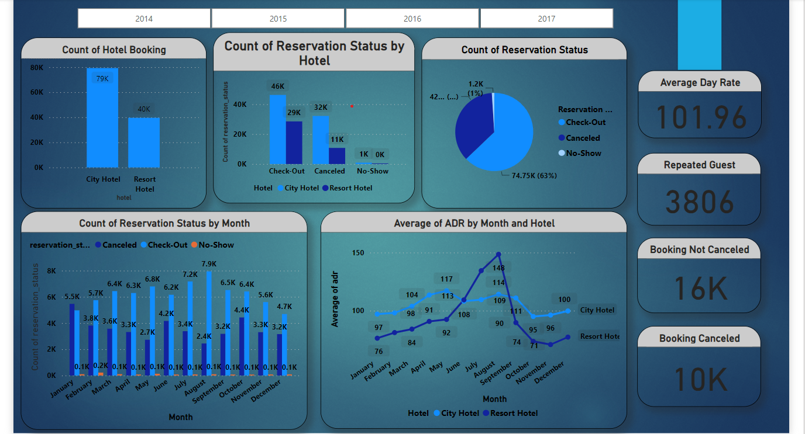

# Hotel-Booking-Analysis-Project

# Hotel Booking Analysis with Python and Power BI
This project focuses on the analysis of hotel booking data using Python's Pandas library for efficient data manipulation. 
The goal is to optimize the hotel booking process and drive business growth by extracting actionable insights and implementing data-driven solutions. 
The project demonstrates successful utilization of Python and Power BI to enhance revenue and improve project performance.

# Objective
The objective of this project is to analyze hotel booking data and extract actionable insights to optimize the hotel booking process. 

# Methodology
The methodology for this project involves using Python's Pandas library for data manipulation and analysis. 
I have utilize Power BI to create a dashboard that visualizes key performance indicators (KPIs) related to hotel bookings.

# Features

Utilized Python's Pandas library for efficient data manipulation and analysis.
Constructed a Power BI dashboard to visualize key performance indicators (KPIs) related to hotel bookings.
Extracted actionable insights from the data to optimize the hotel booking process and drive business growth.

# Results and Impact

Through this project, the following outcomes and impacts were achieved:
Increased revenue by identifying patterns and trends in hotel booking data, allowing for strategic pricing and marketing decisions.
Enhanced the hotel booking process by identifying bottlenecks and implementing improvements based on data-driven insights.
Improved project performance by leveraging Python's Pandas library for efficient data manipulation and analysis.

# Conclusion

In conclusion, this project shows the successful utilization of Python's Pandas library and Power BI to analyze hotel booking data and extract actionable insights. 
These efforts resulted in increased revenue, enhanced customer experience, and improved project performance

